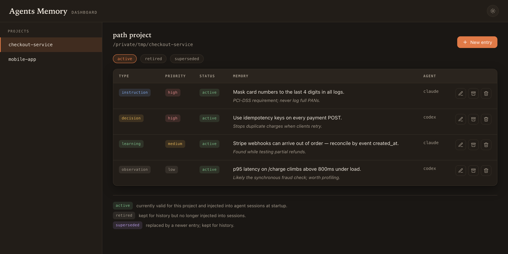

# agents-memory

Project memory for AI coding agents. Each session starts with what earlier ones learned, so you stop repeating yourself and agents stop rediscovering the same things.

Decisions, instructions, learnings, and observations are stored per project in a local SQLite database (`~/.agents-memory/memory.sqlite`). At session start, the active memories for the current project are injected into the agent's context automatically.

## Install

```bash
curl -fsSL https://raw.githubusercontent.com/juancruzrossi/agents-memory/main/scripts/install.sh | bash
```

Requires Python 3.9+ and git. This installs the `agents-memory` CLI onto your `PATH` and symlinks the skills into every coding agent it detects (Claude Code, Codex, OpenCode, Amp).

Re-running the command updates an existing installation. Stored memories are backed up first and never overwritten.

## Setup

`/setup-agents-memory`, `/save-learnings`, and `/get-learnings` are slash commands you run inside your AI coding agent, not in the terminal.

Once per agent, configure startup injection:

```
/setup-agents-memory
```

## Usage

Save memories from the current session. The agent proposes changes and waits for your approval before writing anything:

```
/save-learnings
```

Inspect what's stored for the current project:

```
/get-learnings
```

## Dashboard

Browse and manage every stored memory in a local web UI. Run it in a **new terminal** (not inside your AI agent):

```
agents-memory dashboard
```



This starts a local server and opens your browser automatically. From there you can
navigate projects, add entries, edit them in place, retire them, or permanently delete
them. Pass `--port <n>` to pin a specific port.

## Memory types

| Type | Use when |
|---|---|
| `instruction` | the agent should follow a rule or process |
| `decision` | you chose a direction and want to keep the trade-off |
| `learning` | stable project knowledge worth carrying forward |
| `observation` | something discovered, not yet normative |

Each entry has a priority (`high`, `medium`, `low`) that orders it within the startup budget.

## Supported agents

| Agent | Skills | Startup injection |
|---|---|---|
| Claude Code | ✓ | `SessionStart` hook |
| Codex | ✓ | `SessionStart` hook |
| OpenCode | ✓ | Plugin (`system.transform`) |
| Amp | ✓ | Skills only |

## Development

```bash
uv run pytest                # tests
uv run ruff check src tests  # lint
uv run mypy src              # type-check
bash scripts/update.sh       # sync local changes into ~/.agents-memory
```

## Uninstall

```bash
curl -fsSL https://raw.githubusercontent.com/juancruzrossi/agents-memory/main/scripts/uninstall.sh | bash
```

Removes the agent symlinks and the `PATH` entry from your shell profile. Memories in `~/.agents-memory/memory.sqlite` are kept.
